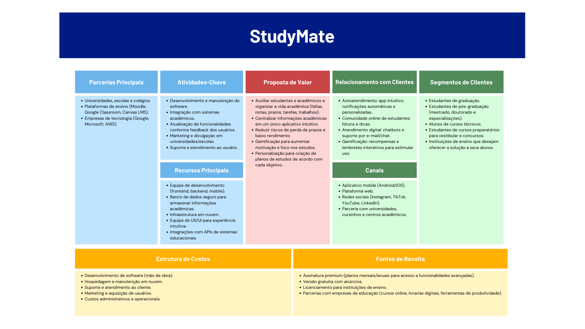

# `StudyMate`

## **Resumo:**
- O StudyMate é um software que visa auxiliar os estudantes com a organização da sua rotina acadêmica. Com o StudyMate, o usuário conseguirá se organizar melhor para atingir as suas metas no qual ele poderá ter acesso a sua agenda, data de provas e trabalhos, plano de estudos e um sistema gameficado.

## **Principais Dores:**
- Falta de organização

- Perda de prazos
- Falta de incentivo nos estudos
- Má gestão de tempo
- Dificuldade de visualização do seu desempenho

## **Modelo de Negócio:**

  

## **Requisitos de Alto Nível:**
### O sistema deve: 

- Permitir que o estudante registre disciplinas, horários e tarefas acadêmicas. 

- Centralizar em um calendário todas as tarefas, provas, trabalhos e prazos. 

- Permitir o acompanhamento de notas, médias e presença. 

- Gerar alertas e notificações de prazos próximos, faltas e notas baixas. 

- Oferecer relatórios de desempenho acadêmico individual e agregado. 

- Disponibilizar lembretes personalizados configuráveis pelo usuário. 

- Possuir gamificação com recompensas, badges e níveis por engajamento. 

- Permitir acesso por aplicativo mobile (iOS e Android) e versão web. 

- Integrar com redes sociais e canais digitais para divulgação.

## **Tecnologias que serão usadas:**

 
 

## **Integrantes e responsaveis:**
- André Machado (Mobile)

- Eduardo Aono (Nuvem)

- Jamilly Okabe  (Banco de Dados)

- João Vitor    (Back-End)

- Kaue Guedes   (Front-End)

- Luiz Gustavo (Front-End)
