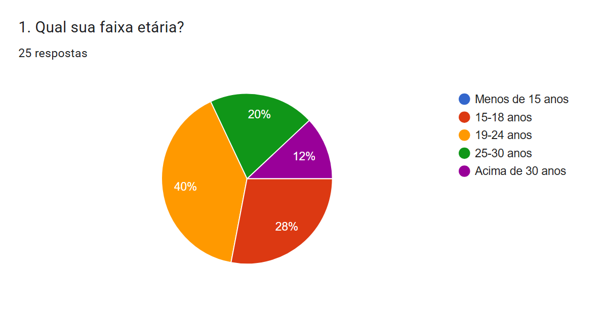
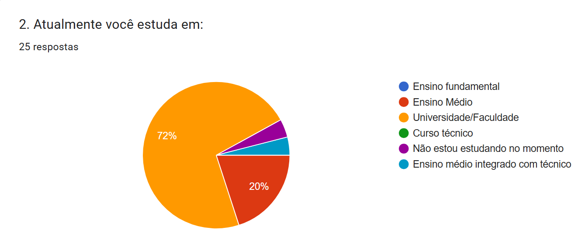
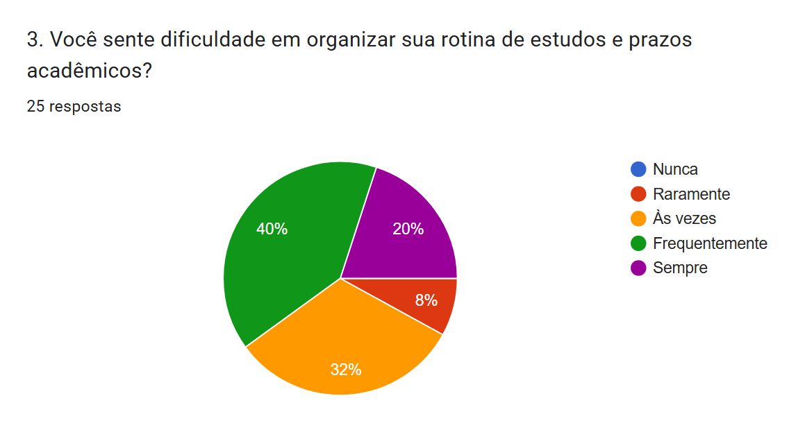
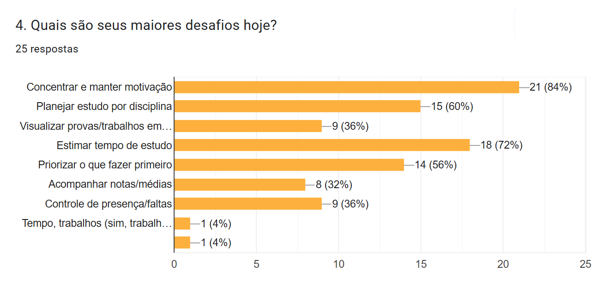
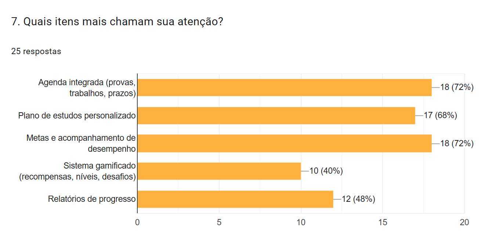
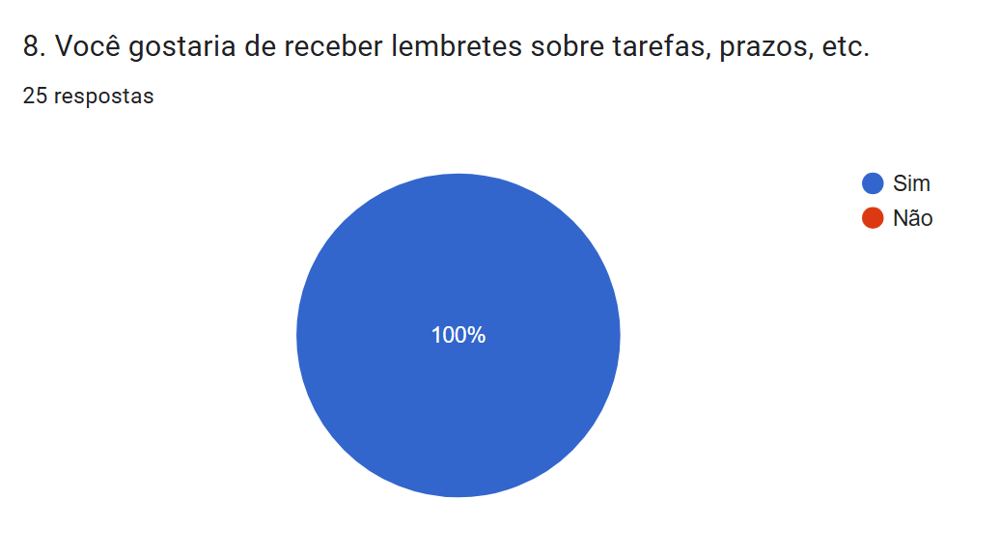
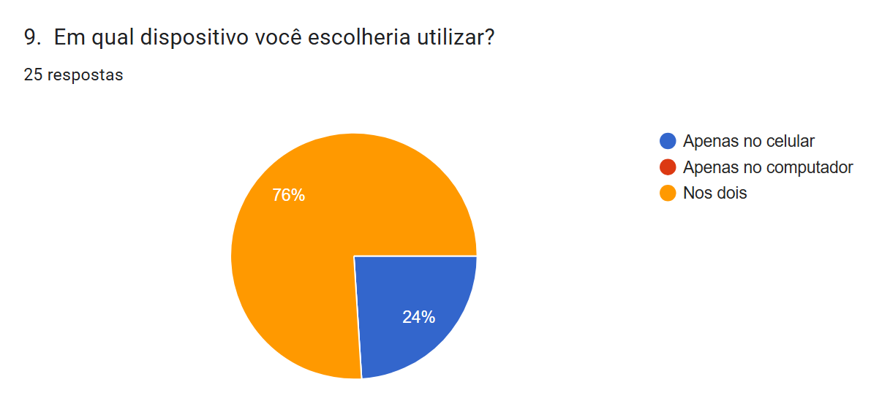
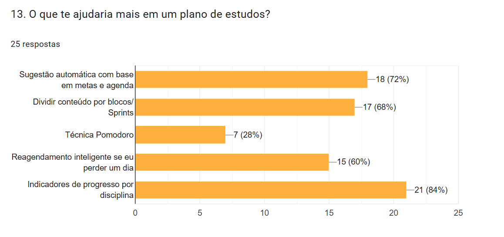
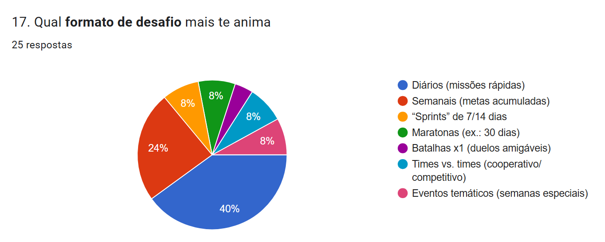
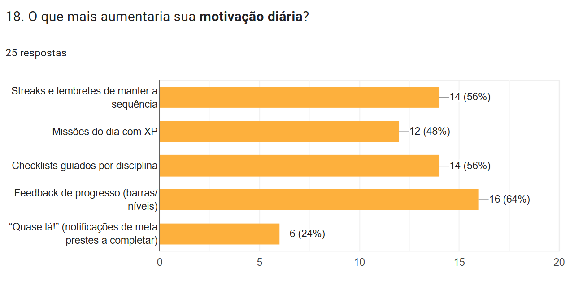

# Pesquisa com alunos – Levantamento de requisitos

## Objetivo

A pesquisa teve como objetivo entender a rotina de estudo dos alunos e identificar dores, necessidades e expectativas em relação a um aplicativo de organização acadêmica e gamificação, o StudyMate.

Buscamos responder principalmente:

- Como os estudantes organizam suas tarefas, provas e trabalhos atualmente?
- Quais são as maiores dificuldades para manter a rotina de estudos em dia?
- Que funcionalidades eles consideram mais importantes em um aplicativo de apoio aos estudos?
- Qual é o nível de interesse em mecânicas de gamificação (nível, XP, conquistas, ranking)?

## Metodologia

- **Ferramenta utilizada:** Google Forms  
- **Público-alvo:** estudantes de qualquer curso/instituição, entre 17 e 40 anos 
- **Período de coleta:** durante o mês de Novembro de 2025
- **Quantidade de respostas:** 25 alunos

O formulário continha perguntas fechadas (múltipla escolha / escala de concordância) e perguntas abertas, permitindo que os alunos descrevessem, com suas próprias palavras, suas dificuldades e sugestões.

## Principais resultados (resumo)

Alguns pontos que se destacaram na pesquisa:

- Muitos alunos ainda não utilizam nenhum tipo de aplicativo para organizar prazos de provas e trabalhos.
- Uma parte significativa relatou dificuldade em **manter consistência** na rotina de estudos (faltam lembretes, visão geral da semana/mês e motivação).
- Houve interesse em:
  - um **calendário unificado** com todas as tarefas e prazos;
  - acompanhamento de **notas e médias** por disciplina;
  - recursos de **gamificação**, como XP, níveis e conquistas, para ajudar na motivação;
  - **notificações** sobre prazos e risco de reprovação.

Esses resultados foram utilizados como base para:

- definição das telas iniciais (dashboard, calendário, disciplinas, conquistas);
- priorização de funcionalidades na primeira versão do protótipo;
- decisões de interface (por exemplo, destacar próximas entregas, mostrar sequência de dias ativos, etc.).

## Gráficos dos Resultados da Pesquisa de Opinião

E na última questão, sendo esta discursiva e opcional, o participante deveria responder o que gostaria de ver em um aplicativo que ajudaria ainda mais a rotina acadêmica. Obtivemos 14 respostas:

- "Facilidade e praticidade de uso."
- "Um aplicativo que motiva você estudar."
- "Certamente a grade acadêmica e uma prévia do que e o quanto cada atividade acadêmica afeta minhas notas, além de um indicador de faltas e o quanto elas podem me impactar. Algumas vezes preciso faltar por conta de trabalho e é importante eu saber os dias que não posso mais faltar."
- "Mostrar em que matéria eu preciso melhorar ou onde eu tenho mais dificuldade, para eu focar nessa matéria e dar mais prioridade."
- "Não sei informar"
- "Praticidade e clareza nas ferramentas e modo de uso."
- "Seria interessante uma área com fórmulas matemáticas e físicas. Área com auxílio com normas ABNT para documento de TCC e coisas do tipo."
- "Um planejador de estudos e prazos de realização de trabalhos definidos por IA."
- "Um app completo que eu possa personalizar e não seja tão complicado de entender."
- "Que seja simples para inserir minhas matérias, faltas, notas e horários. Por um tempo, utilizei o Agenda do Estudante Pro, mas por algum motivo acho o app meio complexo e não muito funcional, precisa colocar tudo manualmente quando inicia um novo semestre com novas matérias, e a parte de inserir as notas é meio confusa no app. Seria muito útil uma aplicação melhor, principalmente na correria dos primeiros semestres"
- "Motivações e uma organização eficiente de tarefas e prazos."
- "Testes diários sobre os conteúdos e simulador de provas."
- "Eu gostaria que as metas se aplicassem aos meus horários disponíveis, por exemplo, que tenho poucos horários livres pra estudar no meu dia. Gostei muito da ideia e preciso desse app."
- "Mentoria."